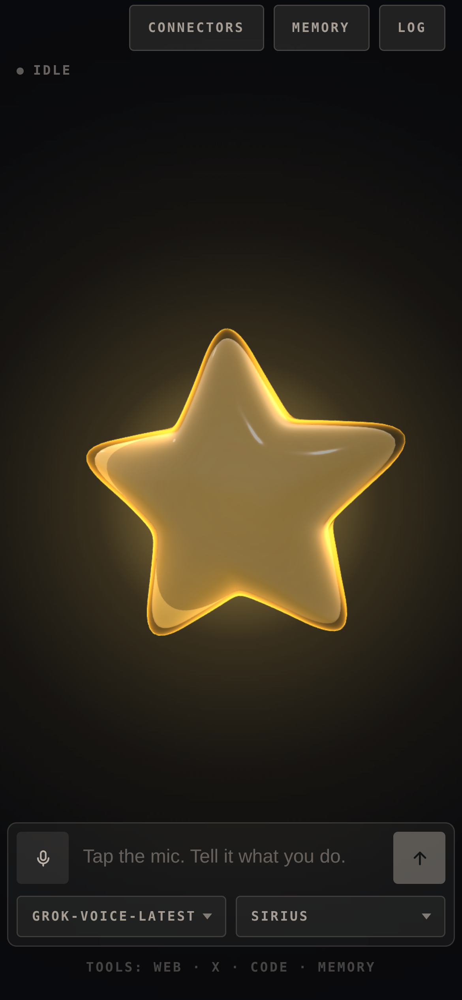

# Vibey

A voice orchestrator for vibe coding, rendered as a five-pointed star of glowing
goo. You describe what you're building out loud; Star reads the task back, holds
the thread, and tells you where things stand. It runs on an xAI Grok
speech-to-speech session, and the wobble, hop and squash are driven by the live
audio, so it moves with whichever of you is talking.

It can search the web and X, run code in xAI's sandbox, and call remote MCP
servers. It also remembers what you tell it to, between calls.

And it can hand the work over. With a connector switched on, Star writes the
task up, dispatches it to **Claude Code**, **Codex**, **OpenCode** or **Grok
Build** running on this machine, and tells you when it lands — while the call
carries on.


<p align="center">
  
</p>

## Run

```sh
npm install
cp .env.example .env      # add your XAI_API_KEY
npm run dev               # → http://localhost:5173
```

Click the mic, allow the browser's microphone prompt, and say what you're
building. Talk over it and it stops — and hops.

The mic button is a microphone switch, not a hang-up: turning it off stops what
you send and leaves the answer playing, and the conversation is still there when
you turn it back on. It also switches itself off after a minute of silence, and
the call survives that too.

| Script | |
|---|---|
| `npm run dev` | Vite, with the proxy mounted as middleware — one process |
| `npm run dev:lan` | The same, over HTTPS on the network — for a phone |
| `npm run build` | Bundles the client to `dist/` |
| `npm start` | Serves `dist/` with the same proxy in front |
| `npm run preview` | `build` then `start` |
| `npm run preview:lan` | `build` then `start`, over HTTPS on the network |
| `npm test` | `node:test`, against a stub xAI socket |
| `npm run lint` | ESLint |

CI runs the lint, the tests on Node 22.12 and 24, and a build that then has to
boot and serve itself over both HTTP and HTTPS.

The coding agents are all off until you switch one on in the **connectors**
panel, because they edit files on the machine the server is running on. Vibey
has no accounts and no auth: **anyone who can reach the page can spend your
agent's tokens on your files.** That's fine for `localhost`, and it is the whole story
before you put it on a LAN with connectors on — see
[connectors](docs/connectors.md).

To run it on a phone, or in Docker, see
[configuration](docs/configuration.md#on-a-phone).

## Docs

- [**Connectors**](docs/connectors.md) — handing work to Claude Code, Codex,
  OpenCode or Grok Build: the panel, what each agent is run as, where tasks show
  up, and the settings a browser deliberately can't reach.
- [**Configuration**](docs/configuration.md) — every environment variable, the
  HTTPS setup a phone needs for microphone access, Docker, and the tools.
- [**Design notes**](docs/design.md) — how the call is wired, the audio path,
  what's in `localStorage`, the moods and the throw, the source layout, and the
  seam another provider would have to implement.
- [**AI Output Disclaimer**](docs/ai-output-disclaimer.md) — what the model says
  is the model's, not the author's, plus the risks that are specific to a live
  microphone and speech you hear before anyone can check it.
- [**Not a Companion**](docs/not-a-companion.md) — Vibey is a tool and a demo.
  It is not a friend, a therapist, or a partner, and the project will not grow in
  that direction.
